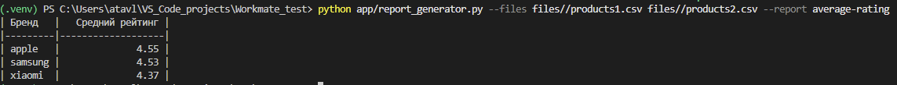
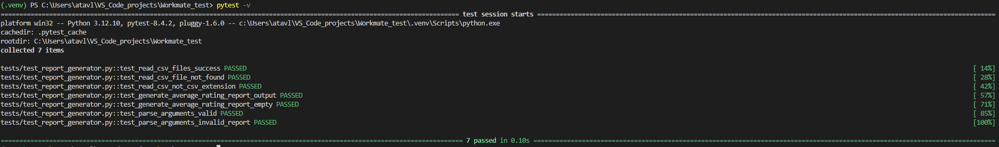

## 1. Активация виртуального окружения

```powershell
python -m venv .venv
.venv/Scripts/Activate.ps1
```

---

## 2. Установка зависимостей

```bash
pip install -r requirements.txt
```

---

## 3. Запуск скрипта

```bash
python app/report_generator.py --files files/products1.csv files/products2.csv --report average-rating
```


---

## 4. Тестирование

```bash
pytest -v
```

